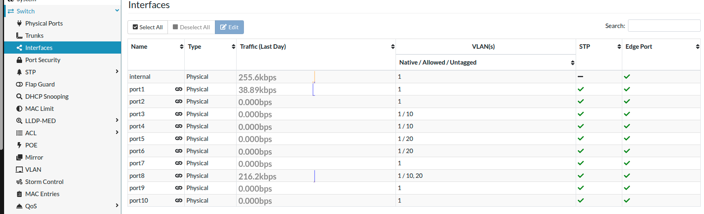
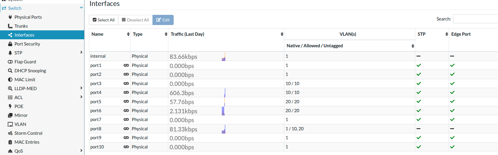

# 📌 Title: Connecting a FortiSwitch 448D in a Cisco Environment


## 🎯 Objective

Connect a FortiSwitch 448D to a Cisco distribution switch and ensure VLAN traffic is properly trunked to the firewall.

---

## 🧱 Environment / Lab Setup

### Devices

* FortiSwitch 448D (Standalone Mode)
* Cisco Catalyst 3850
* FortiGate 60F

### Network

* VLAN 10 → 10.0.10.0/24
* VLAN 20 → 10.0.20.0/24

---

## ⚠️ Problem Description

FortiSwitch was not sending traffic over the trunk to the distribution switch and then to the firewall.

**Issue observed:**

* All traffic defaulted to **VLAN 1**
* VLAN 10 and VLAN 20 were not being preserved across the trunk
* Cisco trunk looked correct, but end-to-end traffic flow failed

---

## 🔍 Root Cause

* VLAN handling differs between Fortinet and Cisco
* Trunk port mismatch (Cisco trunk vs FortiSwitch misconfigured port)
* VLANs not effectively applied on FortiSwitch interface
* Misunderstanding of:

  * Native VLAN behavior
  * FortiLink vs standalone mode
* Port was behaving like an access port

---

## 🛠️ Troubleshooting Steps

### 🔹 Cisco Verification

```bash
show interfaces trunk
show vlan brief
```

### ✔️ Output

```text
Port        Mode             Encapsulation  Status        Native vlan
Gi0/20      on               802.1q         trunking      1

Port        Vlans allowed on trunk
Gi0/20      1,10,20

Port        Vlans allowed and active in management domain
Gi0/20      1,10,20

Port        Vlans in spanning tree forwarding state and not pruned
Gi0/20      1,10,20
```

```text
Switch#show vlan brief

VLAN Name                             Status    Ports
---- -------------------------------- --------- -------------------------------
1    default                          active    Gi0/1, Gi0/2, ...
10   VLAN0010                         active    
20   VLAN0020                         active
```

👉 **Conclusion:** Cisco side is correctly configured.

---

### 🔹 FortiSwitch Checks

* Verified VLANs exist
  → *GUI: Switch → VLAN*

* Verified port status
  → *Switch → Physical Ports*

* Checked VLAN assignment

📸 Interface configuration screenshot:


---

## ✅ Solution / Fix

### ⚠️ Key Difference

**Cisco:**

* Access VLAN → assigns untagged traffic
* Trunk → carries multiple VLANs

**FortiSwitch (Standalone):**

* Must define BOTH:

  * `native-vlan` → untagged traffic
  * `allowed-vlans` → tagged traffic

---

### 🔹 Fix Applied

#### ✔️ Trunk Port (FortiSwitch)

* Configure uplink port to:

  * Allow VLANs **10 and 20**
  * Keep proper native VLAN (usually 1 unless changed)

📸 Final trunk port config:


---

#### ✔️ Access Ports (Important)

To assign VLAN 10:

* Set:

  * `native-vlan = 10`
  * `allowed-vlans = 10`

👉 Without BOTH, traffic falls back to VLAN 1.

---

## 🧪 Verification

* Connected device to FortiSwitch
* Received correct DHCP IP
* Successfully:

  * Pinged gateway
  * Reached other VLANs

---

## 📚 Key Takeaways

* VLAN behavior differs across vendors
* FortiSwitch requires explicit:

  * Native VLAN (untagged)
  * Allowed VLANs (tagged)
* “Trunk” means different things:

  * Cisco → VLAN trunk
  * Fortinet → LAG (link aggregation)
* Misconfigured VLAN = fallback to VLAN 1
* Always verify BOTH sides of the link

---

## 🔄 Improvements / Next Steps

* Move to FortiLink mode for centralized management
* Add inter-VLAN routing on FortiGate 60F
* Automate configuration with Ansible
* Expand multi-vendor lab

---

## 📎 References

* 🎥 [https://youtu.be/5hoPpu_ZGqk?si=pFLXTYT0xOBmVRQJ](https://youtu.be/5hoPpu_ZGqk?si=pFLXTYT0xOBmVRQJ)
* 🎥 [https://youtu.be/W6uC646sl6g?si=fuEBA_tkJ0WIY0Uq](https://youtu.be/W6uC646sl6g?si=fuEBA_tkJ0WIY0Uq)
* 🎥 [https://youtu.be/ULt5VMbz5i0?si=RN-aHp6Aw6X_8qKa](https://youtu.be/ULt5VMbz5i0?si=RN-aHp6Aw6X_8qKa)

---

## 🧩 Tags

`#fortinet #cisco #vlan #trunk #networking #homelab #multivendor`


#
